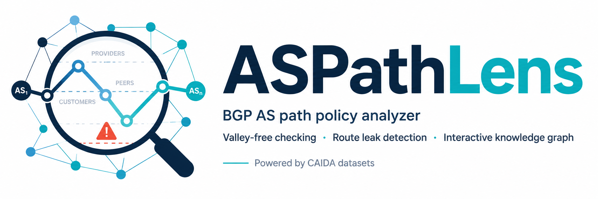
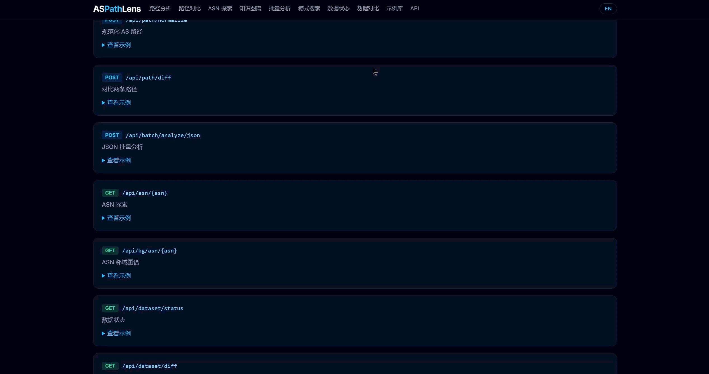

<p align="center">
  
</p>

<h1 align="center">ASPathLens</h1>

<p align="center">
  <strong>A relationship-aware AS path analyzer & lightweight knowledge graph for BGP policy research.</strong>
</p>

<p align="center">
  <a href="#aspathlens-中文"></a>
  <a href="#"></a>
</p>

<p align="center">
  
  
  
  
  
  
</p>

<p align="center">
  <a href="#quick-start">Quick Start</a> ·
  <a href="#features">Features</a> ·
  <a href="#-api-reference">API</a> ·
  <a href="#-architecture">Architecture</a> ·
  <a href="#aspathlens-中文">中文</a>
</p>

<p align="center">
  
</p>

---

> ⚠️ **ASPathLens does not confirm BGP hijacks or route leaks.** It only explains AS path **policy suspiciousness** using commercial relationships and organization mappings.

## Why ASPathLens?

<table>
<tr>
<td width="50%" valign="top">

### 😫 The Problem

- BGP AS paths are opaque number sequences
- Understanding commercial relationships requires cross-referencing multiple CAIDA datasets
- Valley-free violations and route leak patterns are hard to spot manually
- No lightweight tool to explore ASN neighborhoods interactively

</td>
<td width="50%" valign="top">

### 💡 The Solution

- **One-paste analysis** — paste an AS path, get full policy breakdown in seconds
- **CAIDA-powered** — auto-labels every hop with p2c/c2p/p2p relationships
- **Valley-free + route leak** detection with risk scoring
- **Interactive knowledge graph** — explore ASN neighborhoods with force-directed layout

</td>
</tr>
</table>

---

## ✨ Features

| | Feature | Description |
|:---:|:---|:---|
| 🔍 | **Path Analyzer** | Per-hop relationship labels, org mapping, valley-free check, risk score |
| ⚖️ | **Path Diff** | Before/after comparison: ASN delta, risk delta, relationship changes |
| 🌐 | **ASN Explorer** | Per-ASN profile: org info, provider/peer/customer counts, ASRank data |
| 📦 | **Batch Analyzer** | Upload CSV/TXT/JSON → top violation patterns, top suspicious ASNs, export |
| 🕸️ | **Knowledge Graph** | Force-directed graph: ASN neighborhood, path subgraph, org graph, pattern graph |
| 🎯 | **Pattern Search** | Search paths by relationship pattern (e.g. `p2p → c2p`, `p2c → c2p`) |
| 📊 | **Dataset Status** | Live CAIDA data versions, coverage stats, relationship distribution |
| 📚 | **Example Gallery** | Pre-built examples: route leak, valley violation, multi-hop, same-org |
| 🔌 | **REST API** | 9+ endpoints with OpenAPI/Swagger documentation |
| 🖥️ | **CLI Tool** | `aspathlens analyze / diff / batch / dataset` commands |

---

## 📸 Interface Preview

<details open>
<summary><strong>🔍 Path Analyzer</strong> — Full AS path policy breakdown</summary>
<br>
<p align="center">
  
</p>
<p align="center"><em>Paste an AS path → org names, per-hop relationships, valley-free check, route leak detection, risk score</em></p>
</details>

<details>
<summary><strong>⚖️ Path Diff</strong> — Compare two AS paths side by side</summary>
<br>
<p align="center">
  
</p>
<p align="center"><em>Detect ASN replacements, relationship changes, and risk score deltas between two paths</em></p>
</details>

<details>
<summary><strong>🌐 ASN Explorer</strong> — Deep-dive into a single ASN</summary>
<br>
<p align="center">
  
</p>
<p align="center"><em>Org info, provider/peer/customer topology, same-org ASNs, ASRank enhancement</em></p>
</details>

<details>
<summary><strong>📦 Batch Analyzer</strong> — Bulk analysis with aggregate statistics</summary>
<br>
<p align="center">
  
</p>
<p align="center"><em>Upload CSV/TXT/JSON → top violation patterns, suspicious ASNs, per-row results, export</em></p>
</details>

<details>
<summary><strong>🕸️ Knowledge Graph</strong> — Interactive ASN neighborhood exploration</summary>
<br>
<p align="center">
  
</p>
<p align="center"><em>Force-directed graph with 4 layouts: Force · Radial · Hierarchy · Grid. Click to expand neighbors.</em></p>
</details>

<details>
<summary><strong>🎯 Pattern Search</strong> — Search by relationship pattern</summary>
<br>
<p align="center">
  
</p>
<p align="center"><em>Find paths matching specific relationship transitions: p2p→c2p, p2c→c2p, p2c→p2p, etc.</em></p>
</details>

<details>
<summary><strong>🔌 REST API</strong> — Swagger / OpenAPI documentation</summary>
<br>
<p align="center">
  
</p>
<p align="center"><em>Full REST API with interactive Swagger UI at <code>/docs</code></em></p>
</details>

---

## 🏗️ Architecture

```
ASPathLens/
├── backend/                    # FastAPI + Python
│   ├── app/
│   │   ├── api/                # REST endpoints (analysis, batch, KG, ASN, dataset)
│   │   ├── services/           # Core logic (analyzer, valley-free, leak detection, pattern search)
│   │   ├── db/                 # SQLite schema & queries
│   │   ├── models.py           # Pydantic models
│   │   └── main.py             # FastAPI app with lifespan startup
│   ├── data/raw/               # CAIDA raw files (.bz2)
│   ├── scripts/                # Data download & parse scripts
│   └── requirements.txt
├── frontend/                   # React + Vite + Tailwind CSS
│   └── src/
│       ├── pages/              # 11 pages (Analyzer, Diff, Explorer, Batch, KG, Pattern, etc.)
│       ├── components/         # Reusable UI components
│       ├── api/                # Axios API client
│       └── i18n/               # Bilingual (EN/ZH) context
└── docs/screenshots/           # Demo GIFs
```

### Data Pipeline

<table>
<tr>
<td align="center"><strong>📥 Data Sources</strong></td>
<td align="center"><strong>⚙️ Processing</strong></td>
<td align="center"><strong>📊 Analysis</strong></td>
<td align="center"><strong>🖥️ Presentation</strong></td>
</tr>
<tr>
<td>

CAIDA AS Relationship
CAIDA AS2Org
CAIDA ASRank API

</td>
<td>

Parse → SQLite
Load into memory
AS path normalization

</td>
<td>

Per-hop relationship labeling
Valley-free checking
Route leak pattern detection
Risk scoring

</td>
<td>

Web UI (11 pages)
REST API (9+ endpoints)
CLI tool
Python library

</td>
</tr>
</table>

---

## 🚀 Quick Start

### Prerequisites

- **Python** 3.11+
- **Node.js** 18+
- **CAIDA datasets** (downloaded automatically)

### Installation

```bash
# 1. Clone
git clone https://github.com/liuweihua123/ASPathLens.git
cd ASPathLens

# 2. Backend
cd backend
python -m venv .venv && source .venv/bin/activate   # Windows: .venv\Scripts\activate
pip install -r requirements.txt

# 3. Download CAIDA data (~35 MB, one-time)
python scripts/update_all.py

# 4. Start backend
uvicorn app.main:app --reload --port 8000

# 5. Start frontend (new terminal)
cd frontend && npm install && npm run dev
```

Open **http://localhost:5173** — API docs at **http://localhost:8000/docs**

<details>
<summary><strong>🐳 Docker (coming soon)</strong></summary>

```bash
docker compose up --build
```

</details>

---

## 🔌 API Reference

| Method | Endpoint | Description |
|:---:|:---|:---|
| `POST` | `/api/path/analyze` | Full single-path analysis |
| `POST` | `/api/path/diff` | Compare two AS paths |
| `POST` | `/api/batch/analyze/json` | Batch analysis (JSON input) |
| `POST` | `/api/batch/analyze/csv` | Batch analysis (CSV upload) |
| `POST` | `/api/pattern/search` | Search paths by relationship pattern |
| `POST` | `/api/report/export` | Export results (JSON / CSV / Markdown) |
| `GET` | `/api/asn/{asn}` | ASN explorer: org info, neighbors, ASRank |
| `GET` | `/api/kg/asn/{asn}` | Knowledge graph for ASN neighborhood |
| `GET` | `/api/dataset/status` | CAIDA dataset versions & coverage |
| `GET` | `/api/dataset/diff` | Compare dataset versions |

### Example

```bash
curl -X POST http://127.0.0.1:8000/api/path/analyze \
  -H "Content-Type: application/json" \
  -d '{"as_path": "3356 4134 4837 9808"}'
```

<details>
<summary><strong>Response (collapsed)</strong></summary>

```json
{
  "normalized_path": ["3356", "4134", "4837", "9808"],
  "relationship_sequence": ["p2c", "p2c", "p2c"],
  "valley_free": {
    "is_valid": true,
    "explanation_en": "Path follows valley-free routing policy."
  },
  "risk_score": {
    "score": 0,
    "level": "safe"
  }
}
```

</details>

---

## 🖥️ CLI Usage

```bash
# Single path analysis
aspathlens analyze "3356 4134 4837 9808" --format json

# Compare two paths
aspathlens diff "3356 4134" "3356 1299"

# Batch analysis
aspathlens batch paths.csv --output result.csv

# Dataset status
aspathlens dataset status
```

---

## 📊 Data Sources

| Dataset | Source | Usage |
|:---|:---|:---|
| **AS Relationship** (serial-2) | [CAIDA](https://www.caida.org/catalog/datasets/as-relationships/) | Per-hop relationship labels: `p2c`, `c2p`, `p2p` |
| **AS Organizations** | [CAIDA](https://www.caida.org/catalog/datasets/as-organizations/) | ASN → organization mapping, same-org reasoning |
| **ASRank API** | [CAIDA ASRank](https://asrank.caida.org/) | Rank, degree, customer cone (enhancement) |

> No RouteViews, RIPE RIS, BGPStream, RPKI, IRR, or PeeringDB.

---

## 🗺️ Roadmap

- ✅ Path Analyzer with valley-free & route leak detection
- ✅ Path Diff comparison
- ✅ ASN Explorer with ASRank integration
- ✅ Batch analysis with CSV/JSON export
- ✅ Interactive Knowledge Graph (4 layouts)
- ✅ Pattern Search by relationship sequence
- ✅ Bilingual UI (English / 中文)
- ✅ REST API with OpenAPI docs
- 🔜 Docker deployment
- 🔜 Historical BGP data integration (RouteViews / RIPE RIS)
- 🔜 RPKI validation support

---

## 🤝 Contributing

Contributions are welcome! Please feel free to submit issues and pull requests.

---

## 📄 License

MIT License — see [LICENSE](LICENSE) for details.

---

## Acknowledgments

- [CAIDA](https://www.caida.org/) — AS Relationship, AS2Org, and ASRank datasets
- [FastAPI](https://fastapi.tiangolo.com/) — Backend framework
- [React](https://react.dev/) · [Vite](https://vite.dev/) · [Tailwind CSS](https://tailwindcss.com/) · [ECharts](https://echarts.apache.org/) — Frontend stack

---
---

# ASPathLens 中文

<p align="center">
  <a href="#"></a>
  <a href="#aspathlens"></a>
</p>

面向 BGP 路由策略研究的 **AS 路径分析器** 和 **轻量级知识图谱** 工具。

输入一条 AS Path 或 ASN，ASPathLens 自动解析 AS 组织归属、逐跳商业关系、valley-free 策略、潜在 route leak 模式和 AS 邻域拓扑。

支持 **Web UI** · **REST API** · **命令行** · **Python 库** 四种使用方式。

> ⚠️ **ASPathLens 不能确认 BGP 劫持或路由泄露。** 仅基于 AS 商业关系和组织归属判断路径策略可疑性。

---

## 📸 功能预览

<table>
<tr>
<td align="center" width="50%">
<strong>🔍 路径分析器</strong><br>
<br>
<em>粘贴 AS Path → 组织路径、逐跳关系、valley-free、route leak、风险评分</em>
</td>
<td align="center" width="50%">
<strong>⚖️ 路径对比</strong><br>
<br>
<em>Before/After 路径对比：ASN 变化、关系变化、风险差异</em>
</td>
</tr>
<tr>
<td align="center">
<strong>🌐 ASN 探索</strong><br>
<br>
<em>单个 ASN 深度画像：组织信息、provider/peer/customer、ASRank</em>
</td>
<td align="center">
<strong>📦 批量分析</strong><br>
<br>
<em>CSV/TXT/JSON 批量分析 → Top 违规模式、可疑 ASN、导出</em>
</td>
</tr>
<tr>
<td align="center">
<strong>🕸️ 知识图谱</strong><br>
<br>
<em>力导向图谱探索 ASN 邻域，支持 Force / Radial / Hierarchy / Grid 四种布局</em>
</td>
<td align="center">
<strong>🎯 模式搜索</strong><br>
<br>
<em>按关系模式搜索路径：p2p→c2p、p2c→c2p、p2c→p2p</em>
</td>
</tr>
</table>

---

## 🚀 快速开始

### 环境要求

- **Python** 3.11+
- **Node.js** 18+

### 安装与启动

```bash
# 1. 克隆项目
git clone https://github.com/liuweihua123/ASPathLens.git
cd ASPathLens

# 2. 后端
cd backend
python -m venv .venv && source .venv/bin/activate   # Windows: .venv\Scripts\activate
pip install -r requirements.txt

# 3. 下载 CAIDA 数据（约 35 MB，仅需一次）
python scripts/update_all.py

# 4. 启动后端
uvicorn app.main:app --reload --port 8000

# 5. 启动前端（新终端）
cd frontend && npm install && npm run dev
```

打开 **http://localhost:5173** — API 文档：**http://localhost:8000/docs**

---

## 🔌 API 接口

| 方法 | 接口 | 说明 |
|:---:|:---|:---|
| `POST` | `/api/path/analyze` | 单路径完整分析 |
| `POST` | `/api/path/diff` | 两条路径对比 |
| `POST` | `/api/batch/analyze/json` | 批量分析（JSON） |
| `POST` | `/api/batch/analyze/csv` | 批量分析（CSV） |
| `POST` | `/api/pattern/search` | 按关系模式搜索 |
| `POST` | `/api/report/export` | 导出报告（JSON / CSV / Markdown） |
| `GET` | `/api/asn/{asn}` | ASN 探索：组织、邻居、ASRank |
| `GET` | `/api/kg/asn/{asn}` | ASN 知识图谱 |
| `GET` | `/api/dataset/status` | 数据集状态 |
| `GET` | `/api/dataset/diff` | 数据集版本对比 |

---

## 📊 数据来源

| 数据集 | 来源 | 用途 |
|:---|:---|:---|
| **AS Relationship** (serial-2) | [CAIDA](https://www.caida.org/catalog/datasets/as-relationships/) | 逐跳商业关系标注：`p2c`、`c2p`、`p2p` |
| **AS Organizations** | [CAIDA](https://www.caida.org/catalog/datasets/as-organizations/) | ASN → 组织映射、同组织推理 |
| **ASRank API** | [CAIDA ASRank](https://asrank.caida.org/) | Rank、degree、customer cone（增强数据） |

---

## 📄 许可证

MIT License — 详见 [LICENSE](LICENSE)。

---

## 致谢

- [CAIDA](https://www.caida.org/) — AS Relationship、AS2Org、ASRank 数据集
- [FastAPI](https://fastapi.tiangolo.com/) · [React](https://react.dev/) · [Vite](https://vite.dev/) · [Tailwind CSS](https://tailwindcss.com/) · [ECharts](https://echarts.apache.org/)
