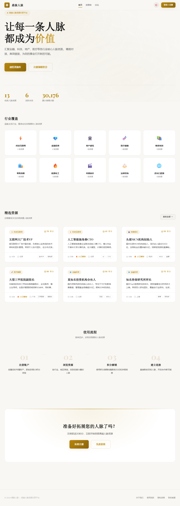
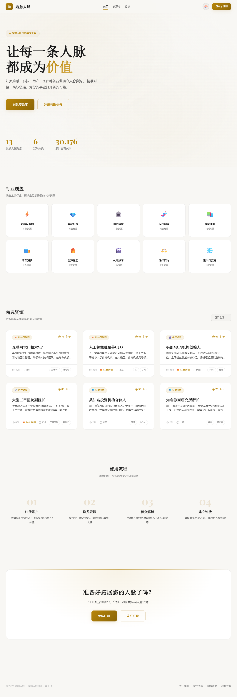
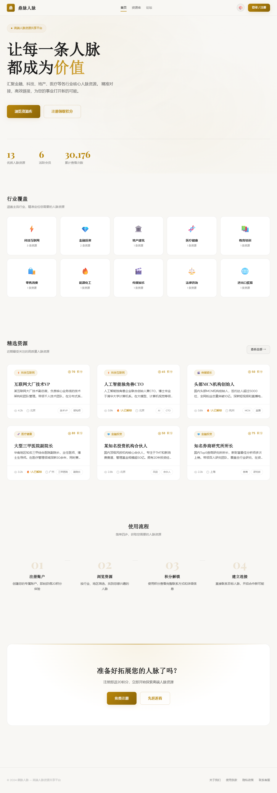
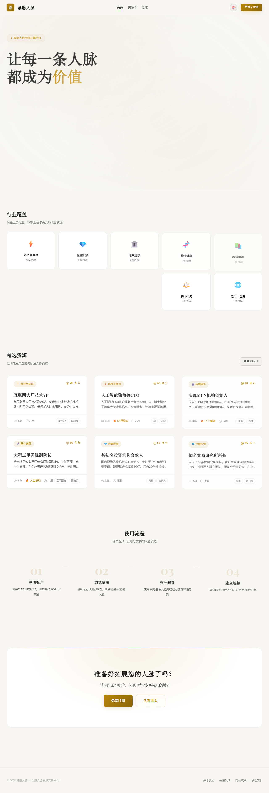
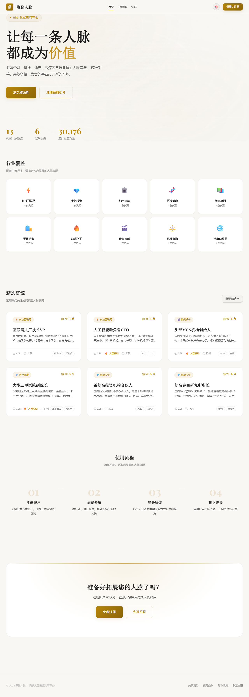
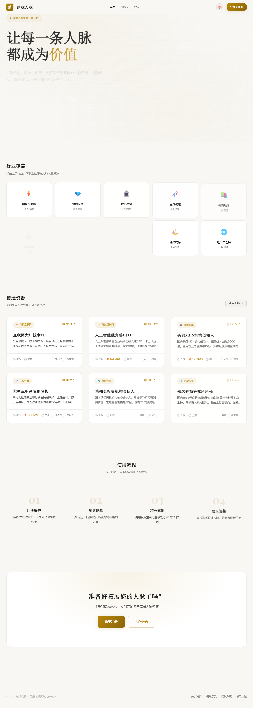

# ASPathLens

> **English** | [中文](#aspathlens-中文)

A relationship-aware AS path analyzer and lightweight AS knowledge graph for BGP policy research.

Paste an AS path or ASN. ASPathLens explains AS ownership, AS relationships, valley-free policy, potential route-leak patterns, and AS neighborhood topology using **CAIDA ASRelationship**, **AS2Org**, and **ASRank**.

Use it as a **Web UI**, **REST API**, **CLI tool**, or **Python library**.

> ⚠️ **ASPathLens does not confirm BGP hijacks or route leaks.**
> It only explains AS path **policy suspiciousness** using AS relationships and organization mappings.

<p align="center">
  
</p>

---

## Quick start

```bash
# 1. Clone
git clone https://github.com/liuweihua123/ASPathLens.git
cd ASPathLens

# 2. Backend
cd backend
python -m venv .venv && source .venv/bin/activate   # Windows: .venv\Scripts\activate
pip install -r requirements.txt

# 3. Download CAIDA data (~35 MB, one-time)
python scripts/download_asrel.py
python scripts/download_as2org.py
python scripts/parse_asrel.py
python scripts/parse_as2org.py
# or: python scripts/update_all.py

# 4. Start backend
uvicorn app.main:app --reload --port 8000

# 5. Start frontend (new terminal)
cd frontend && npm install && npm run dev
```

Open **http://localhost:5173** — Swagger UI at **http://localhost:8000/docs**

---

## Path Analyzer

Analyze a single AS path: org names, per-hop relationships, valley-free check, risk score.

<p align="center">
  
</p>

**Example:** `3356 4134 4837 9808` — shows Lumen → China Telecom → China Unicom → China Mobile, p2c → p2c → p2c, valley-free valid, risk 0.

---

## Path Diff

Compare before/after paths: ASN replacement, risk delta, relationship change.

<p align="center">
  
</p>

**Example:** `3356 4134 4837 9808` vs `3356 1299 4837 9808` — shows risk delta +90, added ASN 1299, relationship change p2p → p2p.

---

## ASN Explorer

Per-ASN profile with org info, provider/peer/customer counts, same-org ASNs, ASRank enhancement.

<p align="center">
  
</p>

**Example:** AS4134 — China Telecom, CN, 145 customers, 721 peers, 5 providers.

---

## Batch Analyzer

Upload CSV/TXT/JSON for batch analysis. Top violation patterns, top suspicious ASNs, per-row results, CSV/JSON export.

<p align="center">
  
</p>

---

## Knowledge Graph

Explore ASNs as a force-directed graph. Click any ASN node to expand its neighbors. Multiple layouts: Force, Radial, Hierarchy, Grid.

<p align="center">
  
</p>

**Modes:** ASN Neighborhood · Path Subgraph · Organization Graph · Pattern Graph

---

## Pattern Search · Dataset Status · Examples

<p align="center">
   c2p">
</p>

<p align="center">
  
</p>

<p align="center">
  
</p>

---

## REST API

| Method | Path | Description |
|--------|------|-------------|
| POST | `/api/path/analyze` | Full path analysis |
| POST | `/api/path/diff` | Compare two paths |
| POST | `/api/batch/analyze/json` | Batch analyze |
| POST | `/api/pattern/search` | Pattern search |
| POST | `/api/report/export` | Export (JSON/CSV/Markdown) |
| GET | `/api/asn/{asn}` | ASN explorer |
| GET | `/api/kg/asn/{asn}` | ASN knowledge graph |
| GET | `/api/dataset/status` | Dataset status |
| GET | `/api/dataset/diff` | Dataset version diff |

```bash
curl -X POST http://127.0.0.1:8000/api/path/analyze \
  -H "Content-Type: application/json" \
  -d '{"as_path":"3356 4134 4837 9808"}'
```

---

## CLI

```bash
aspathlens analyze "3356 4134 4837 9808" --format json
aspathlens diff "3356 4134" "3356 1299"
aspathlens batch paths.csv --output result.csv
aspathlens dataset status
```

---

## Data sources

| Source | Usage |
|--------|-------|
| CAIDA AS Relationship (serial-2) | Per-hop relationship labels: p2c, c2p, p2p |
| CAIDA AS2Org | ASN → organization mapping, same-org reasoning |
| CAIDA ASRank API | Rank, degree, customer cone (enhancement only) |

No RouteViews, RIPE RIS, BGPStream, RPKI, IRR, or PeeringDB.

---

## Citation

- [CAIDA AS Relationships Dataset](https://www.caida.org/catalog/datasets/as-relationships/)
- [CAIDA AS Organizations Dataset](https://www.caida.org/catalog/datasets/as-organizations/)
- [CAIDA ASRank](https://asrank.caida.org/)

---

## License

MIT — see [LICENSE](LICENSE).

---
---

# ASPathLens 中文

> [English](#aspathlens) | **中文**

面向 BGP 路由策略研究的 AS 路径分析器和轻量级 AS 知识图谱工具。

输入一条 AS Path 或 ASN，ASPathLens 自动解析 AS 组织归属、逐跳商业关系、valley-free 策略、潜在 route leak 模式和 AS 邻域拓扑，基于 **CAIDA ASRelationship**、**AS2Org** 和 **ASRank**。

支持 **Web UI**、**REST API**、**命令行** 和 **Python 库** 四种使用方式。

> ⚠️ **ASPathLens 不能确认 BGP 劫持或路由泄露。**
> 仅基于 AS 商业关系和组织归属判断路径策略可疑性。

---

## 路径分析器

输入 AS Path，自动输出组织路径、逐跳关系、valley-free 检测、route leak 候选和风险评分。

<p align="center">
  
</p>

**示例：**`3356 4134 4837 9808` → Lumen → China Telecom → China Unicom → China Mobile，关系序列 p2c → p2c → p2c，valley-free 合法，风险 0。

---

## 路径对比

对比 before/after 两条路径：ASN 变化、风险差异、关系变化。

<p align="center">
  
</p>

---

## ASN 探索

查看某个 ASN 的组织信息、provider/peer/customer 数量、同组织 AS、ASRank 增强。

<p align="center">
  
</p>

---

## 批量分析

上传 CSV/TXT/JSON 批量分析。输出 Top 违规模式、Top 可疑 ASN、每行详细结果、CSV/JSON 导出。

<p align="center">
  
</p>

---

## 知识图谱

力导向图谱探索 ASN 邻域。点击任意 ASN 节点可向外扩展邻居。支持 Force / Radial / Hierarchy / Grid 四种布局。

<p align="center">
  
</p>

---

## 模式搜索 · 数据状态 · 示例库

<p align="center">
   c2p">
</p>

<p align="center">
  
</p>

<p align="center">
  
</p>

---

## 数据来源

| 数据源 | 用途 |
|--------|------|
| CAIDA AS Relationship (serial-2) | 逐跳商业关系标注：p2c、c2p、p2p |
| CAIDA AS2Org | ASN → 组织映射、同组织推理 |
| CAIDA ASRank API | Rank、degree、customer cone（仅作增强） |

---

## 引用

- [CAIDA AS Relationships Dataset](https://www.caida.org/catalog/datasets/as-relationships/)
- [CAIDA AS Organizations Dataset](https://www.caida.org/catalog/datasets/as-organizations/)
- [CAIDA ASRank](https://asrank.caida.org/)

---

## 许可证

MIT — 参见 [LICENSE](LICENSE)。
